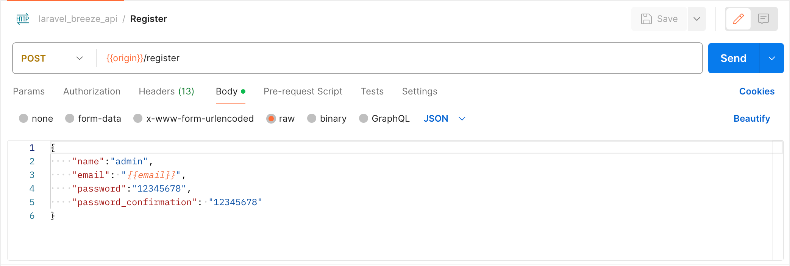
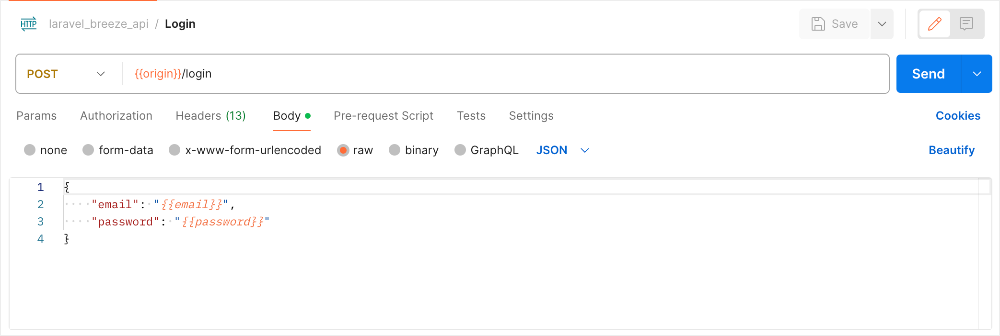
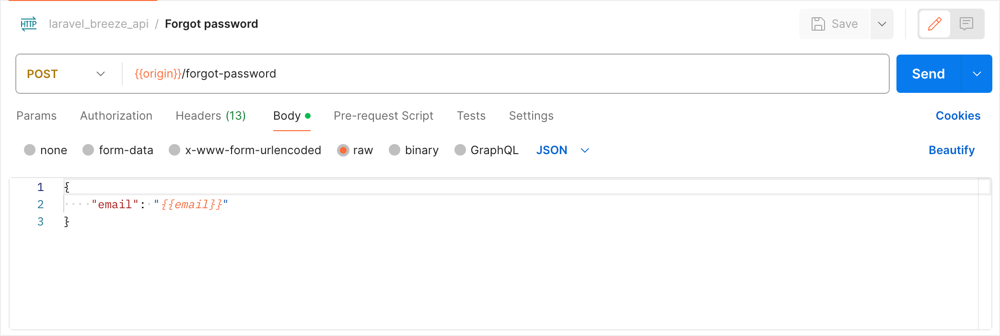
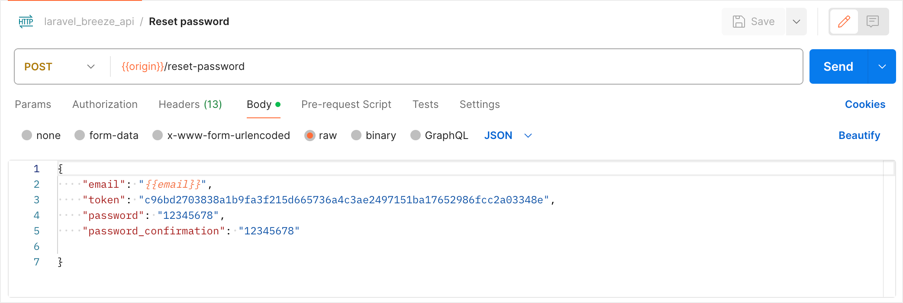
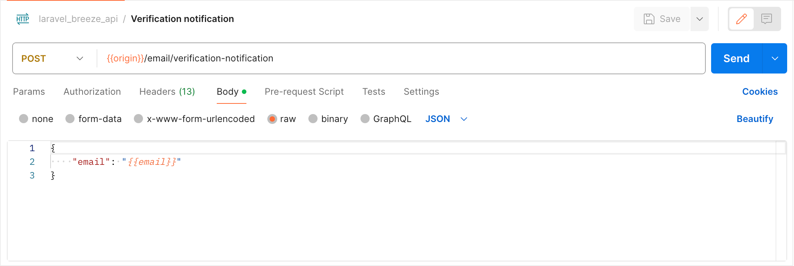
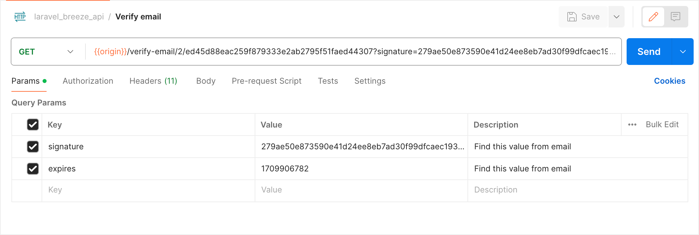

<p align="center"><a href="https://laravel.com" target="_blank"></a></p>

This project demonstrates the integration of Breeze for authentication APIs in Laravel applications. I Postman collection added that show how to integrate the APIs on frontend.

## System requirements
- PHP 8.1^
- composer 2.5^
- MySQL (recommended)

## How to set up
- Clone this project.
- Run this command to generate .env `composer run-script post-root-package-install`

### Production
- Run command `composer install --no-dev`
- Update the .env
```
APP_ENV=production
APP_DEBUG=false
```

### Development
- Run command `composer install`
- No need to update **APP_ENV** and **APP_DEBUG**

### Common steps
- Connect database
    ```
      DB_CONNECTION=mysql (recommended)
      DB_HOST=<DATABASE HOST>
      DB_PORT=<DATABASE PORT>
      DB_DATABASE=<DATABASE NAME>
      DB_USERNAME=<DATABASE USERNAME>
      DB_PASSWORD=<DATABASE PASSWORD>
    ```
- Run following command one by one
    - `php artisan migrate`
    - `php artisan db:seed`
---
# Postman
## Register


## Login


## Log out


## Forgot password


## Reset password

- As shown in image this request requires **token** that send in mail.
- When user click on link in mail it open a frontend page.
- User enter new password and on submit send all information with token 

## Mail verification notification


## Verify email

- This request not require any frontend page
- When user click on link in mail it will reach to backend, 
- Backend validate it and set timestamp for email verify.
- After verification, it will redirect to home page because to verify user need to login first.
